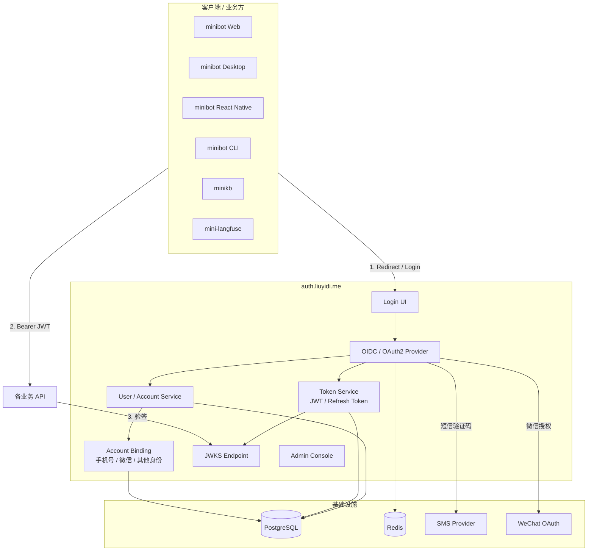

# `auth.liuyidi.me` 第一版设计文档

> 目标：把当前这个后端演进成一个可复用的统一身份中心，供 `minibot`、`minikb`、`mini-langfuse` 等业务系统统一接入。

## 1. 背景

当前项目已经具备最基础的用户注册、登录、JWT 刷新和登出能力，但它仍然更像一个单体业务后端，而不是一个可对外复用的统一认证中心。

下一阶段的目标不是继续强化某一个业务接口，而是把它抽象成一个独立的身份平台：

- 对外域名：`auth.liuyidi.me`
- 服务定位：统一登录、统一身份、统一 token 签发
- 接入对象：其他业务系统、Web、Desktop、RN、CLI

这意味着它需要同时满足以下诉求：

- 统一发放 JWT，业务系统通过标准协议接入
- **不依赖外部资质即可用**：邮箱登录 / 验证码（前提是完成可控发信域名、邮件服务商配置以及 SPF / DKIM / DMARC；及后续 OIDC）
- **资质依赖（见 §15.2）**：手机号短信登录、微信登录 / 绑定
- 后续可扩展 Passkey、MFA 等

## 2. 设计目标

### 2.1 产品目标

- 让多个业务共享同一个账号体系
- 让登录能力集中在一个地方维护
- 降低每个业务重复实现登录、短信、微信回调、token 管理的成本
- 让移动端、Web、桌面端、CLI 的认证体验尽量统一

### 2.2 技术目标

- 协议优先：使用标准 OIDC / OAuth 2.0 接入
- Token 标准化：使用 JWT 作为访问令牌
- 状态分层：短期状态放 Redis，持久化状态放 PostgreSQL
- Provider 可扩展：GitHub 先落地通用外部 OAuth adapter，短信、Google、微信沿用身份抽象
- 安全可控：PKCE、一次性 code、refresh token 轮换、限流、审计

## 3. 术语约定

为了避免“OAuth、OIDC、SSO、JWT”混在一起，这里先统一一下定义：

- **OAuth 2.0**：授权协议，描述应用如何获取访问权限
- **OIDC**：建立在 OAuth 2.0 上的登录协议，适合做统一身份认证
- **SSO**：单点登录效果，不是协议本身
- **JWT**：令牌格式，不是登录协议
- **IdP**：Identity Provider，统一身份提供方
- **Authorization Server**：负责发放授权码、访问令牌、刷新令牌的服务

对于 `auth.liuyidi.me`，推荐的准确定位是：

- **OIDC Identity Provider**
- **OAuth 2.0 Authorization Server**
- **SSO Center**
- **JWT Issuer**

## 4. 第一版技术选型

### 4.1 固定方案

- **Auth 服务**：独立后端服务，域名 `auth.liuyidi.me`
- **协议**：OIDC Authorization Code + PKCE
- **主 token**：JWT `access_token`
- **状态存储**：PostgreSQL
- **验证码 / 短期状态**：Redis
- **短信**：Provider 抽象预留；**上线依赖资质**（见 §15.2），未就绪前默认关闭
- **微信**：Provider 抽象预留；**上线依赖资质**（见 §15.2），未就绪前默认关闭

### 4.2 为什么是这个组合

- OIDC 能让各业务系统用标准方式接入
- Authorization Code + PKCE 适合 Web、桌面、移动端和 CLI
- JWT 适合做跨服务鉴权
- PostgreSQL 适合长期存储用户、绑定关系、会话、审计
- Redis 适合存验证码、授权码、state、nonce、限流计数器
- Provider 抽象可以避免后面换短信厂商或增加微信以外的第三方登录时大改

## 5. 总体架构

## 6. 服务拆分建议

第一版建议先按下面几个逻辑模块拆：

### 6.1 Login UI

职责：

- 提供统一登录页
- 支持 Google 登录
- 支持邮箱验证码登录
- 支持登录态回跳

形式：

- Web 页面
- 后续可作为桌面端 / 移动端的统一登录入口

### 6.2 OIDC / OAuth2 Provider

职责：

- 生成 authorization code
- 校验 PKCE
- 生成 access token / refresh token / id token
- 暴露 OIDC discovery、JWKS、userinfo 等标准接口

### 6.3 Token Service

职责：

- 签发 JWT access token
- 签发 refresh token
- 处理 token 轮换、失效、撤销
- 管理 token claims

### 6.4 User / Account Service

职责：

- 用户注册和登录
- 用户资料管理
- 账号绑定
- 手机号唯一性约束
- 微信 openid / unionid 绑定

### 6.5 SMS Provider

职责：

- 发送短信验证码
- 后续可替换不同供应商
- 统一封装重试、限流、错误码

### 6.6 WeChat Provider

职责：

- 微信开放平台 OAuth
- 获取微信身份信息
- 绑定微信账号到本地用户

### 6.7 Session / Rate Limit / Short-lived State

职责：

- 保存验证码
- 保存授权码
- 保存 state / nonce / PKCE verifier
- 保存限流计数
- 保存短期登录上下文

## 7. 登录方式设计

### 7.1 主流程：OIDC Authorization Code + PKCE

这是所有客户端统一使用的主协议。

适用对象：

- Web
- Desktop
- React Native
- CLI

流程：

1. 客户端跳转到 `https://auth.liuyidi.me/oauth/authorize`
2. 用户选择 Google 或邮箱验证码登录
3. Auth 服务完成身份校验
4. Auth 服务带上 `authorization code` 回跳到客户端 `redirect_uri`
5. 客户端向 `POST https://auth.liuyidi.me/oauth/token` 使用 `code + code_verifier` 换取 token
6. 客户端拿到 `access_token`，后续请求业务 API 时携带 `Bearer` token

### 7.1.1 第一版登录策略

结合当前资质和上线节奏，第一版认证入口建议收敛为：

- `Google` 登录
- 邮箱 + 验证码登录

不建议单独保留传统“注册页”作为主入口，而是把“注册”并入首次登录：

- 用户第一次用邮箱验证码完成验证时，自动创建账户
- 如果后续接入 Google，首次 Google 登录也可以自动建档并完成绑定
- 对用户来说只保留一个登录入口，避免“注册 / 登录”两个页面分流

这样做的好处是：

- 不需要企业资质就能跑通主路径
- 登录体验更轻，减少表单和流程分叉
- 后续补短信、微信、Apple 等 provider 时，不用改主入口结构

### 7.2 手机号 + 短信验证码

适用：

- 首次注册
- 登录
- 找回 / 验证手机号

建议流程：

1. 输入手机号
2. Auth 服务生成验证码并写入 Redis
3. 调用短信 provider 发短信
4. 用户输入验证码
5. 校验成功后创建或登录用户
6. 绑定手机号到本地账户

### 7.3 微信登录

适用：

- 微信内 / 微信外登录
- 已有微信身份的用户快速登录

建议流程：

1. 客户端点击“微信登录”
2. Auth 服务跳转微信 OAuth
3. 微信回调到 Auth 服务
4. Auth 服务获取微信身份信息
5. 如果已有绑定用户，直接登录
6. 如果没有绑定用户，创建新用户或引导绑定手机号

## 8. 前端与客户端接入策略

## 9. Token 设计

为了避免 `Web`、`React Native` 各自维护一套登录逻辑，建议把前端拆成两个层次：

### 8.1 `mini-auth` 内部的前端工作区

在本仓库下新增 `frontend/` 工作区，专门承载认证相关前端：

- `frontend/apps/web`：桌面 Web 登录页，同时作为 H5 响应式登录页
- `frontend/packages/auth-rn`：RN 认证 SDK（client / PKCE / token）+ 原生登录页（`./screens`）

这样做的目标是：

- Web 通过响应式布局覆盖桌面和移动端，不再额外维护独立 H5 页面
- 登录、刷新、登出、PKCE、回跳逻辑统一沉到 SDK
- 后续 React Native 只消费单一共享包，不需要复制认证实现

### 8.2 React Native 的接入方式

`minibot-react-native` 不建议直接依赖整套前端 UI 仓库，而是依赖 `auth-rn`：

- 原生登录页从 `@liuyidi/auth-rn/screens` 引入（过渡期 Minibot 仍可保留本地副本）
- SDK 负责调用 `mini-auth` 的认证接口
- Google / GitHub 用系统浏览器完成 IdP 授权，登录壳本身保持原生

### 8.3 推荐边界

- `Web`：托管登录页（`apps/web`）
- `auth-rn`：SDK + 原生登录页
- `minibot-react-native`：会话、导航、OAuth 回调（过渡期仍有本地 `MiniLoginScreen`）
- `mini-auth` 后端：统一认证核心

### 8.1 Token 类型

第一版建议至少支持：

- `access_token`
- `refresh_token`
- `id_token`，如果采用 OIDC 标准返回

### 8.2 Access Token

建议：

- 格式：JWT
- 有效期：短一些，比如 15 分钟到 1 小时
- 用途：业务 API 鉴权

### 8.3 Refresh Token

建议：

- 有效期：长一些，比如 7 天到 30 天
- 用途：静默续期
- 策略：轮换刷新，旧 refresh token 立即失效

### 8.4 推荐 Claims

JWT 中建议至少包含：

- `sub`：用户唯一 ID
- `iss`：`https://auth.liuyidi.me`
- `aud`：客户端或业务系统标识
- `exp`：过期时间
- `iat`：签发时间
- `sid`：会话 ID
- `phone`：可选
- `wechat_openid`：可选
- `tenant` 或 `org`：如果未来做多租户
- `scope`：授权范围

### 8.5 验签方式

业务服务只需要：

- 从 `/.well-known/jwks.json` 获取公钥
- 本地验 JWT 签名和过期时间
- 必要时校验 `iss`、`aud`、`scope`

## 10. 数据存储设计

### 9.1 PostgreSQL

PostgreSQL 负责所有持久化数据：

- 用户
- 账号绑定
- 业务客户端
- 会话
- refresh token
- 审计日志
- provider 配置

### 9.2 Redis

Redis 负责短期态：

- 短信验证码
- 登录 state
- PKCE verifier
- authorization code
- 限流计数
- 临时风控标记

## 11. 核心数据表建议

### 10.1 `users`

用户主表。

建议字段：

- `id`
- `display_name`
- `avatar_url`
- `status`
- `created_at`
- `updated_at`

### 10.2 `user_identities`

外部身份绑定表。

建议字段：

- `id`
- `user_id`
- `provider`：`phone` / `github` / `google` / `wechat`
- `provider_subject`：手机号、GitHub numeric id、Google sub、微信 openid 等稳定标识
- `provider_union_id`
- `created_at`
- `updated_at`

### 10.3 `auth_clients`

接入的业务客户端。

建议字段：

- `client_id`
- `client_secret_hash`
- `redirect_uris`
- `allowed_scopes`
- `pkce_required`
- `status`

### 10.4 `auth_sessions`

登录会话表。

建议字段：

- `id`
- `user_id`
- `client_id`
- `created_at`
- `expires_at`
- `revoked_at`
- `last_seen_at`

### 10.5 `refresh_tokens`

刷新令牌表。

建议字段：

- `id`
- `session_id`
- `token_hash`
- `rotated_from`
- `expires_at`
- `revoked_at`

### 10.6 `audit_logs`

审计日志表。

建议字段：

- `id`
- `actor_user_id`
- `action`
- `target_type`
- `target_id`
- `ip`
- `user_agent`
- `created_at`

### 10.7 `sms_codes` / `auth_codes`

短期态一般建议放 Redis，但如果你想要更强审计，也可以把关键事件落一份数据库事件表。

## 12. 标准协议接口建议

第一版建议至少提供这些标准能力：

### OIDC 标准接口

- `GET /.well-known/openid-configuration`
- `GET /oauth/authorize`
- `POST /oauth/token`
- `GET /oauth/userinfo`
- `GET /oauth/jwks.json`

### 业务管理接口

- `POST /api/v1/auth/phone/start`（**资质依赖**：短信）
- `POST /api/v1/auth/phone/verify`（**资质依赖**：短信）
- `GET /api/v1/auth/wechat/start`（**资质依赖**：微信）
- `GET /api/v1/auth/wechat/callback`（**资质依赖**：微信）
- `GET /api/v1/auth/github/start`
- `GET /api/v1/auth/github/callback`
- `POST /api/v1/auth/logout`
- `POST /api/v1/auth/refresh`
- `GET /api/v1/me`

未满足对应资质时：接口应返回明确错误（如 `provider_not_configured` / `qualification_pending`），客户端隐藏或灰显入口，**不得假装可用**。

### 管理接口

- `GET /api/v1/admin/users`
- `GET /api/v1/admin/sessions`
- `GET /api/v1/admin/audit-logs`
- `POST /api/v1/admin/providers/sms`
- `POST /api/v1/admin/providers/wechat`

## 13. 客户端接入方式

### 12.1 Web

- 使用 OIDC redirect flow
- 登录后回跳到业务站点
- 前端通过 access token 调用业务 API

### 12.2 Desktop

- 推荐使用系统浏览器 + deep link
- 登录后回跳到桌面端自定义协议或本地回调地址

### 12.3 React Native

- 推荐使用系统浏览器或内嵌外部浏览器页
- 用 PKCE 避免在移动端暴露 client secret

### 12.4 CLI

- 使用 device-like 交互或本地回调页
- 也可以先支持“复制授权码”模式
- Device Flow 作为 CLI 的补充方案，适合无浏览器或弱输入环境，后续再单独推进

## 14. 安全设计

### 13.1 必做项

- Authorization Code + PKCE
- 所有敏感 token 只返回一次
- refresh token 轮换
- 短信验证码限频
- 登录失败次数限制
- IP / 设备 / 手机号维度风控
- 重要操作审计
- JWT 签名使用非对称密钥

### 13.2 推荐项

- MFA
- account linking
- 风险设备识别
- 会话管理
- 登录提醒
- 异常地点 / 异常设备提示

## 15. 部署建议

### 14.1 组件部署

- `auth.liuyidi.me`：Auth 服务
- PostgreSQL：主数据库
- Redis：缓存与短期态
- 邮件服务商：用于邮箱验证码、登录通知、告警通知
- SMS Provider：外部服务
- WeChat Open Platform：外部服务

### 14.2 邮件验证码配置

当前推荐的落地方式是把“域名与发信控制”放在阿里云，把“业务代码”继续留在腾讯云：

- `auth.liuyidi.me` 的 DNS 和解析继续放在阿里云
- 邮件验证码服务优先选阿里云 DirectMail，便于和 DNS、备案、域名认证统一管理
- `noreply@liuyidi.me` 只是发件人地址，不是单独的发信服务
- 真正的发信能力来自邮件服务商，代码只负责调用它的 API 或 SMTP

需要在邮件服务商和 DNS 里一起准备的配置包括：

- 发信域名验证
- `SPF`
- `DKIM`
- `DMARC`
- 必要时的 `MX`
- 验证码模板
- 发送频率限制

#### 14.2.1 执行步骤

1. 在阿里云选择邮件服务商，优先开通 DirectMail。
2. 在邮件服务商控制台中添加 `mail.liuyidi.me` 作为发信子域，并完成域名验证。
3. 按控制台要求在阿里云 DNS 中添加对应记录：
   - `SPF`
   - `DKIM`
   - `DMARC`
   - 必要时的 `MX`
4. 在邮件服务商里创建发件人地址，例如 `noreply@mail.liuyidi.me`。
5. 创建“登录验证码”邮件模板，模板里只保留最小必要信息：
   - 验证码
   - 过期时间
   - 安全提醒
6. 在 `mini-auth` 后端配置邮件服务商凭证和模板 ID。
7. 实现或接通邮箱验证码发送接口。
8. 实现或接通验证码校验接口。
9. 在前端登录页接入“发送验证码”和“提交验证码”两个动作。
10. 用 Gmail / Outlook / QQ 邮箱分别测试收件、延迟和垃圾箱命中情况。

#### 14.2.2 可执行配置清单

**DNS 配置**

| 项目 | 放在哪里 | 说明 |
|------|----------|------|
| `SPF` | 阿里云 DNS | 允许邮件服务商代表 `liuyidi.me` 发信 |
| `DKIM` | 阿里云 DNS | 供收件方校验邮件签名 |
| `DMARC` | 阿里云 DNS | 定义 SPF / DKIM 失败时的处理策略 |
| `MX` | 阿里云 DNS | 仅在服务商要求收信或验证时配置 |

**邮件服务商配置**

| 项目 | 示例 | 说明 |
|------|------|------|
| 发信域名 | `mail.liuyidi.me` | 推荐使用专门的发信子域，降低和主站点的耦合 |
| 发件人地址 | `noreply@mail.liuyidi.me` | 登录验证码默认发件人 |
| 显示名称 | `Minibot` | 对外展示为 `Minibot <noreply@mail.liuyidi.me>` |
| 验证码模板 | `auth_login_code` | 统一模板 ID，便于后端引用 |
| 回执 / 告警地址 | `ops@liuyidi.me` | 用于退信、异常和运维通知 |

**后端环境变量**

| 变量名 | 示例 | 说明 |
|--------|------|------|
| `EMAIL_PROVIDER` | `aliyun_directmail` | 当前启用的邮件服务商 |
| `EMAIL_FROM` | `Minibot <noreply@mail.liuyidi.me>` | 默认发件人显示名与地址 |
| `EMAIL_TEMPLATE_LOGIN_CODE` | `auth_login_code` | 登录验证码模板 |
| `EMAIL_CODE_TTL_SECONDS` | `600` | 验证码有效期，建议 5-10 分钟 |
| `EMAIL_CODE_RESEND_SECONDS` | `60` | 重发间隔，避免刷接口 |
| `EMAIL_CODE_MAX_ATTEMPTS` | `5` | 单个验证码最大校验次数 |
| `EMAIL_RATE_LIMIT_PER_IP` | `10` | 单 IP 发送限流阈值 |
| `EMAIL_RATE_LIMIT_PER_EMAIL` | `5` | 单邮箱发送限流阈值 |
| `EMAIL_SERVICE_API_KEY` | `***` | 邮件服务商 API key |
| `EMAIL_SERVICE_SECRET` | `***` | 如服务商需要 secret 则配置 |

**前端 / 产品配置**

| 项目 | 说明 |
|------|------|
| 登录入口文案 | “Google 登录” / “邮箱验证码登录” |
| 首次登录行为 | 自动创建账户，不再分离注册页 |
| 错误提示 | 验证码错误、过期、发送太频繁、邮箱不可用 |
| 倒计时 | 重发按钮倒计时，减少重复请求 |

这样分工的好处是：

- 你现在的公网入口、域名和邮件投递都在阿里云侧统一管理
- 业务服务继续部署在腾讯云，不影响现有代码和发布节奏
- 后面如果切换邮件服务商，只需要改邮件层，不需要改认证核心

### 14.3 域名建议

- `auth.liuyidi.me`：统一认证中心
- `bot.liuyidi.me`：minibot
- `kb.liuyidi.me`：minikb
- `mlf.liuyidi.me`：mini-langfuse

### 14.4 反向代理建议

- 所有 auth 路由走 HTTPS
- OIDC 回调地址必须严格白名单
- JWKS、discovery 等公共接口可以缓存，但建议保留较短缓存时间

### 14.5 备案与入口转发

如果 `auth.liuyidi.me` 目前的正式部署还在腾讯云，但入口域名已经希望先对外使用，可以采用：

- `auth.liuyidi.me` 先解析到阿里云已备案服务器
- 阿里云 Nginx 作为公网入口
- Nginx 再反向代理到腾讯云上的真实 Auth 服务

这样可以先把“备案入口”和“代码部署”解耦，等腾讯云侧备案和接入条件稳定后再考虑是否收敛架构。

需要注意的是：

- 代理层必须正确透传 `Host`、`X-Forwarded-Proto`、`X-Forwarded-For`
- 登录回调、Cookie 域、CSRF 校验要以公网入口域名为准
- OIDC 回调 URI 要和最终对外域名保持一致，避免中间代理导致 `redirect_uri` 不匹配

## 16. 第一版 MVP 范围

### 15.1 不依赖外部资质（先做）

- 统一登录页骨架
- **Google 登录**
- **邮箱 + 验证码**登录 / 首次自动注册
- 不单独拆“注册页”，注册动作并入首次登录
- 邮箱验证码本身不依赖短信 / 微信那类专项资质，但需要可控发信域名、邮件服务商、SPF / DKIM / DMARC，以及验证码频率控制
- OIDC Authorization Code + PKCE
- JWT access token + refresh token
- JWKS 发布
- 业务客户端注册
- 简单审计日志
- Provider 抽象与配置开关（短信 / 微信默认关闭）

### 15.2 资质依赖项（具备后再开）

国内短信与微信都不是「写完接口就能上线」，需主体与备案到位。统一记为 **资质依赖项**：

| 能力 | 依赖资质（常见） | 未就绪时 |
|------|------------------|----------|
| **短信验证码登录 / 注册** | 域名 ICP 备案；短信服务商企业认证；签名 / 模板审核；业务侧合规告知 | 关闭 `phone` provider；接口返回 `qualification_pending` |
| **微信登录 / 绑定** | 微信开放平台企业认证；网站或移动应用审核；授权回调域 / 包名签名；根域 ICP 备案 | 关闭 `wechat` provider；同上 |

说明：

- 短信与微信**都**依赖备案与主体，不要假设「短信比微信更好拿」
- 代码可先实现 provider 接口与路由占位，但 **默认不启用**，等配置齐全再打开
- 资质办理与工程实现并行，互不阻塞 MVP

### 15.3 明确延后

- Passkey
- 复杂 MFA
- 企业 SSO
- 多租户控制台
- 高级权限模型

## 17. 迭代路线

### Phase 0 — 资质与基础设施（并行）

- 域名 ICP 备案（若尚未完成）
- 配置邮件发送域名、SPF / DKIM / DMARC 和邮件服务商
- 评估短信服务商（阿里云 / 腾讯云短信等）与开放平台主体
- 部署 `auth.liuyidi.me`（已具备 Compose：API + PG + Redis + Caddy）

### Phase 1 — 无资质阻塞的身份核心

- OIDC discovery / authorize / token / userinfo / jwks
- 邮箱验证码登录 + Google 登录演进到统一用户模型
- JWT 签发；至少一个业务（如 minibot）用 access JWT bootstrap
- Provider 开关：`sms_enabled=false`，`wechat_enabled=false`

### Phase 2 — 短信（资质齐后）

- 开通短信签名与模板
- 跑通 `phone/start` + `phone/verify`
- 限流、风控、审计

### Phase 3 — 微信（资质齐后）

- 开放平台应用通过审核
- 跑通 `wechat/start` + `wechat/callback` 与账号绑定
- refresh 轮换、account linking 强化

### Phase 4 — 平台化

- 管理后台、更完整审计与风控
- 多业务 client 管理
- 扩展 Passkey / MFA / 更多 provider

## 18. 和当前仓库（mini-auth）的关系

本仓库由原 `deepseek-chat-api` 演进而来，已具备「注册 / 登录 / JWT 刷新 / 登出」基础能力，在新方案里作为：

- `auth.liuyidi.me` 的第一版实现基础
- 后续统一身份中心的核心服务仓库

也就是说，当前项目不需要推倒重来，而是顺着现有实现继续演进到：

- 标准 OIDC 接口
- 标准 token 体系
- 外部业务复用

## 19. 下一步建议

推荐按下面顺序推进（**短信 / 微信不挡主路径**）：

1. 定稿数据库表和 token / JWT claims
2. 补齐 OIDC discovery / authorize / token / jwks
3. 邮箱验证码 + Google 登录 + 统一用户模型，让 `minibot` 先接 access JWT
4. 并行办理 ICP / 短信 / 微信开放平台资质（见 §15.2）
5. 资质通过后再开短信，再开微信
